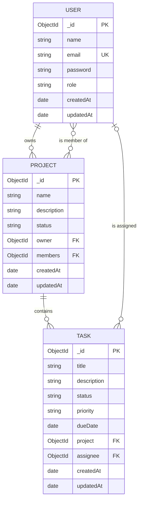

# TaskFlow — Data Model

**Database:** MongoDB (document) with Mongoose for schema validation
**Deliverable:** Week 1, Day 2 — schema design for Users, Projects and Tasks

---

## Why MongoDB, and how we keep it disciplined

MongoDB does not enforce a schema at the database level. Mongoose is therefore doing
the job that `CREATE TABLE` constraints would do in MySQL: required fields, allowed
values, uniqueness, and types are declared in the application layer and validated on
every write.

Relationships are modelled by **reference** (storing an `ObjectId` that points at another
document), not by embedding. The reasoning:

- **Tasks are not embedded inside Projects.** A project can accumulate hundreds of tasks,
  and we need to query, filter and update tasks on their own (for example, "all tasks
  assigned to me, across every project"). Embedding would force us to load an entire
  project to touch one task, and MongoDB documents have a 16 MB ceiling.
- **Users are separate** because the same user is referenced from several places — as a
  project owner, a project member, and a task assignee. Duplicating user data into each
  of those places would mean updating an email in many documents at once.

This keeps the model close to a normalised relational design, which is why the ER diagram
below reads like a conventional one.

---

## Entity relationship diagram

### Relationships in words

| Relationship | Type | Implemented as |
| --- | --- | --- |
| A user owns many projects | one-to-many | `Project.owner` → `User._id` |
| A project has many members, a user belongs to many projects | many-to-many | `Project.members[]` → `User._id` |
| A project contains many tasks | one-to-many | `Task.project` → `Project._id` |
| A user is assigned many tasks | one-to-many (optional) | `Task.assignee` → `User._id` |

---

## Collections

### `users`

| Field | Type | Rules | Notes |
| --- | --- | --- | --- |
| `_id` | ObjectId | auto | Primary key |
| `name` | String | required, 2–60 chars, trimmed | Display name |
| `email` | String | required, **unique**, lowercased, valid format | Login identifier |
| `password` | String | required, min 8 chars on input | Stored as a bcrypt hash, never returned by default |
| `role` | String | `admin` \| `member`, default `member` | Gates the Week 3 admin CMS |
| `createdAt` / `updatedAt` | Date | auto | Mongoose timestamps |

**Indexes:** unique index on `email`.

Two decisions to note. The `password` field is declared `select: false`, so it is excluded
from query results unless explicitly asked for — this makes it very hard to leak a hash
through an API response by accident. And `role` exists now, even though nothing uses it
yet, because Week 3 requires a protected admin area; adding it later would mean a data
migration.

### `projects`

| Field | Type | Rules | Notes |
| --- | --- | --- | --- |
| `_id` | ObjectId | auto | Primary key |
| `name` | String | required, 2–120 chars, trimmed | |
| `description` | String | optional, max 2000 chars | |
| `status` | String | `active` \| `on-hold` \| `completed` \| `archived`, default `active` | |
| `owner` | ObjectId → `users` | required | Who created it; has full control |
| `members` | [ObjectId → `users`] | default `[]` | Collaborators |
| `createdAt` / `updatedAt` | Date | auto | |

**Indexes:** `owner`, and a text index on `name` for search in later weeks.

### `tasks`

| Field | Type | Rules | Notes |
| --- | --- | --- | --- |
| `_id` | ObjectId | auto | Primary key |
| `title` | String | required, 2–200 chars, trimmed | |
| `description` | String | optional, max 5000 chars | |
| `status` | String | `todo` \| `in-progress` \| `done`, default `todo` | Drives the dashboard columns |
| `priority` | String | `low` \| `medium` \| `high`, default `medium` | |
| `dueDate` | Date | optional | |
| `project` | ObjectId → `projects` | required | Every task belongs to exactly one project |
| `assignee` | ObjectId → `users` | optional | Unassigned tasks are allowed |
| `createdAt` / `updatedAt` | Date | auto | |

**Indexes:** compound index on `project` + `status` (the dashboard's main query),
plus an index on `assignee`.

---

## Referential integrity

MongoDB will not cascade deletes for us the way a SQL foreign key can. We handle it in
the application:

- Deleting a **project** also deletes its tasks, so no task is left pointing at a project
  that no longer exists.
- Deleting a **user** clears them from `Project.members` and unsets `Task.assignee`
  rather than deleting their work.

This is the main trade-off of choosing a document database for relational data, and it is
worth stating out loud in review: the integrity rules still exist, they just live in our
code instead of in the schema.
